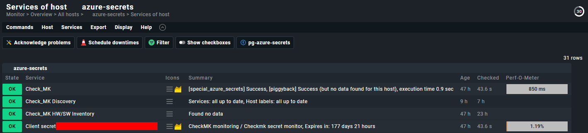
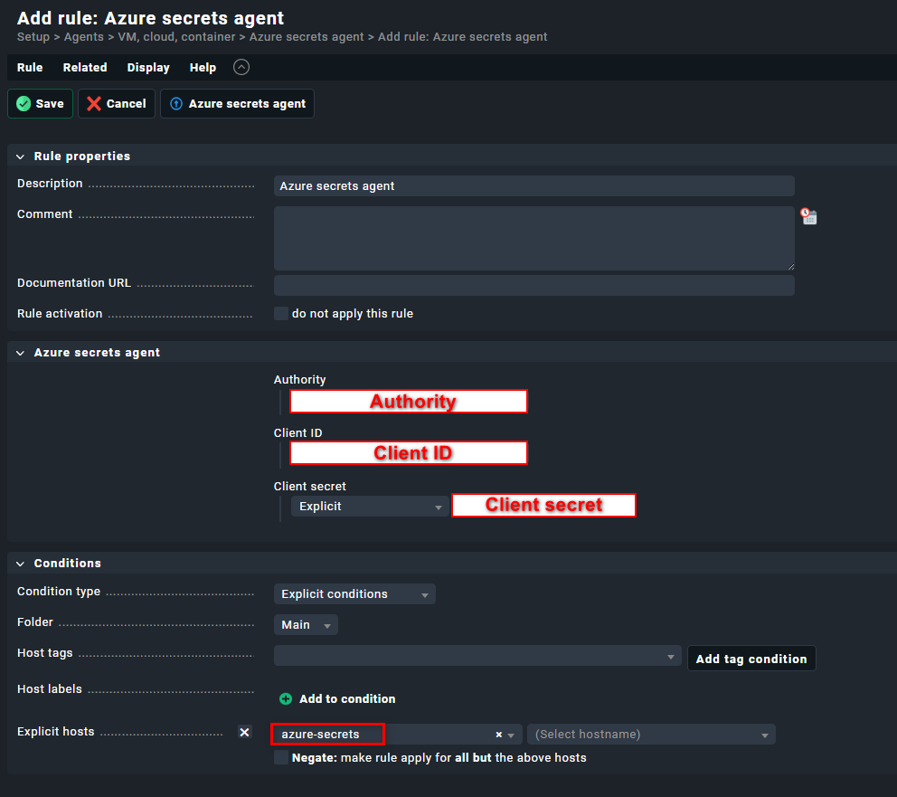

# Example output of plugin


# Steps to monitor azure client secrets in Checkmk.
## Configure an application in Azure
While configuring Azure, take note of the following data that will be used when configuring the special agent.

| Config in Checkmk | Config in Azure                             |
|-------------------|---------------------------------------------|
| Authority         | https://login.microsoftonline.com/TENANT_ID |
| Client ID         | CLIENT_ID                                   |
| Client secret     | CLIENT_SECRET                               |

1. Create an application registration.


2. In the created app, create a client secret.


3. Assign the application read permissions. Also don't forget to grant admin consent.


While doing the steps, take note of the following data that will be needed when configuring the azure_secrets special agent.

## Configure Checkmk.
### Download and install the mkp file in Checkmk.

### Add a host
This host will represent a connection to Azure for a single tenant.
Services will be created for all client secrets in all applications.


### Create a rule to configure azure_secrets plugin



### Go to the host, run service discovery and apply changes.

# Development

## Environment
* This project was built using Jetbrains PyCharm, Docker desktop and dev-containers.
* When running the dev-container the default username and password is: cmkadmin.
* The address to Checkmk is: http://localhost:5000.
If you have other apps listening to port 5000, you need to modify devcontainer.json.

## Build mkp
1. Open a terminal in the docker image.
2. Execute the build script. 
```shell
$WORKSPACE/.devcontainer/build.sh
```
